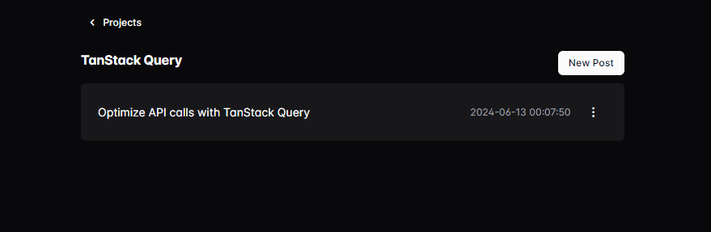

# TanStack Query로 API 호출 최적화


## 예제 프로젝트 설정
1. 이 저장소를 클론합니다.
2. `pnpm install`을 실행합니다.
3. `pnpm run db:setup`으로 데이터베이스를 설정합니다.
4. `pnpm run dev`로 프로젝트를 실행합니다.

### DB 초기화
이 프로젝트는 SQLite를 사용합니다. 데이터베이스를 초기화하려면 `./server/sqlite.db` 파일을 삭제하고, `pnpm run db:setup`을 실행하세요.


## 비교 프로젝트
TanStack Query를 사용하지 않은 프로젝트와 비교하려면 `without-tanstack-query` 브랜치를 참고하세요.

## Backend API 명세
#### Project 리스트 조회
- URL: `/api/projects`
- Method: `GET`
- Response:
  ```json
  [
    {
      "id": 1,
      "name": "Project 1",
      "description": "Description 1",
      "createdAt": "2021-08-01 00:00:00",
    },
    ...
  ]
  ```

#### Project 상세 조회
- URL: `/api/projects/:id`
- Method: `GET`
- Response:
  ```json
  [
    {
      "id": 1,
      "name": "Project 1",
      "description": "Description 1",
      "createdAt": "2021-08-01 00:00:00",
    },
    ...
  ]
  ```

#### Project 생성
- URL: `/api/projects`
- Method: `POST`
- Request:
  ```json
  {
    "name": "Project 1",
    "description": "Description 1", // (Optional)
  }
  ```
- Response:
  ```json
  {
    "insertedId": 1
  }
  ```

#### Project 수정
- URL: `/api/projects/:id`
- Method: `PATCH`
- Request:
  ```json
  {
    "name": "Project 1",
    "description": "Description 1", // (Optional)
  }
  ```
- Response:
  ```json
  {
    "updatedId": 1
  }
  ```

#### Project 삭제
- URL: `/api/projects/:id`
- Method: `DELETE`
- Response:
  ```json
  {
    "deletedId": 1
  }
  ```
  ---
#### Post 리스트 조회
- URL: `/api/posts`
- Method: `GET`
- Response:
  ```json
  [
    {
      "id": 1,
      "title": "Post 1",
      "content": "Content 1",
      "createdAt": "2021-08-01 00:00:00",
    },
    ...
  ]
  ```

#### Post 상세 조회
- URL: `/api/posts/:id`
- Method: `GET`
- Response:
  ```json
  [
    {
      "id": 1,
      "title": "Post 1",
      "content": "Content 1",
      "createdAt": "2021-08-01 00:00:00",
    },
    ...
  ]
  ```

#### Post 생성
- URL: `/api/posts`
- Method: `POST`
- Request:
  ```json
  {
    "projectId": 1,
    "title": "Post 1",
    "content": "Content 1", // (Optional)
  }
  ```
- Response:
  ```json
  {
    "insertedId": 1
  }
  ```
#### Post 수정
- URL: `/api/posts/:id`
- Method: `PATCH`
- Request:
  ```json
  {
    "title": "Post 1",
    "content": "Content 1", // (Optional)
  }
  ```
- Response:
  ```json
  {
    "updatedId": 1
  }
  ```
#### Post 삭제
- URL: `/api/posts/:id`
- Method: `DELETE`
- Response:
  ```json
  {
    "deletedId": 1
  }
  ```